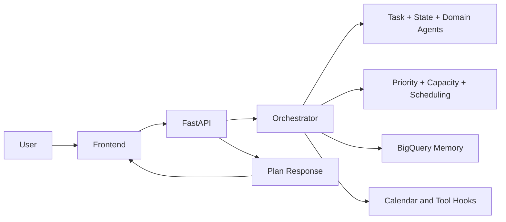

# Productivity Agent

Productivity Agent is a FastAPI application that turns free-form task input into a multi-day plan using Gemini-powered task extraction, lightweight state inference, and a capacity-based scheduling engine. It includes a browser UI, BigQuery-backed memory, and Google Calendar integration hooks.

## Problem Statement

People often know what they need to do, but struggle to convert a messy list of tasks, shifting priorities, and real-life constraints into a realistic day-by-day plan. Traditional to-do tools capture tasks, but they usually do not adapt well to changing energy levels, urgent deadlines, follow-up plan changes, or limited daily capacity.

## Objective

The objective of Productivity Agent is to turn natural-language planning requests into an actionable, flexible schedule that helps users prioritize work, adjust plans through simple follow-up instructions, and manage overflow tasks with better visibility and control.

## What This Repo Does

The system accepts task descriptions such as:

```text
Finish Q2 report (high, hard, due tomorrow), review inbox (medium, easy)
```

It then:

- extracts structured tasks from natural language
- detects user state such as `normal`, `fatigued`, or `overwhelmed`
- prioritizes and schedules work across upcoming days
- flags unscheduled tasks when capacity is exceeded
- supports follow-up plan modification requests
- proposes calendar actions and can create Google Calendar events
- stores user history and backlog context in BigQuery

## Architecture At A Glance

The repo is organized into a few focused layers:

- `main.py`: FastAPI app, route definitions, frontend serving, and direct scheduling endpoint
- `agents/`: orchestration, task extraction, state handling, and domain-specific heuristics
- `engine/`: priority rules, state pruning, effort mapping, and schedule generation
- `memory/`: BigQuery persistence for history and backlog
- `models/`: shared Pydantic request/response models
- `tools/`: tool wrappers for calendar, summary storage, and mock task-manager behavior
- `frontend/`: static single-page UI for chat-driven planning



## Core Workflow

1. The user sends tasks from the browser UI or directly to `POST /plan`.
2. `agents.task_agent` extracts tasks with Gemini and falls back to local parsing if needed.
3. `agents.state_agent` and `engine.state_rules` infer a planning state from text, explicit energy input, recent history, and workload.
4. `engine.priority` upgrades urgent tasks and orders the backlog.
5. `engine.state_rules.prune_tasks` removes work that should not be scheduled in lower-capacity states.
6. `agents.orchestrator` spreads progressive tasks, schedules work into day buckets, and returns a structured response.
7. The frontend renders scheduled days, unscheduled tasks, adjustments, and optional follow-up actions.

## Main Features

- Natural-language task intake with structured extraction
- Clarification flow when priority or difficulty is missing
- Cold-start handling for new users with minimal history
- Dynamic state-aware pruning for `fatigued`, `overwhelmed`, and `constrained` modes
- Priority boosting for near-deadline tasks
- Progressive task splitting across multiple days
- Manual scheduling of unscheduled tasks back into the plan
- Proposed Google Calendar actions with confirm flow
- Domain-specific helper tasks for travel and newborn-care contexts
- BigQuery-backed history and pending backlog retrieval

## Repository Structure

```text
.
|-- agents/
|   |-- orchestrator.py
|   |-- task_agent.py
|   |-- state_agent.py
|   `-- domain_agents.py
|-- engine/
|   |-- scheduler.py
|   |-- priority.py
|   |-- capacity.py
|   `-- state_rules.py
|-- frontend/
|   |-- index.html
|   |-- app.js
|   `-- style.css
|-- memory/
|   `-- bigquery_client.py
|-- models/
|   `-- schemas.py
|-- tools/
|   |-- calendar_tool.py
|   |-- task_manager_tool.py
|   |-- summary_tool.py
|   `-- mcp_server.py
|-- main.py
|-- oauth_setup.py
|-- Dockerfile
`-- requirements.txt
```

## Tech Stack

- Python 3.12 runtime in Docker; Python 3.11+ is a safe local target
- FastAPI and Uvicorn for the web service
- Pydantic v2 for schemas
- Google Gemini via `google-genai`
- Google BigQuery for user memory/history
- Google Calendar API for event creation
- Static HTML/CSS/JavaScript frontend

## Setup

Install dependencies:

```bash
pip install -r requirements.txt
```

Create a `.env` file with the variables your environment needs:

```env
GEMINI_API_KEY=your_gemini_api_key
GEMINI_MODEL=gemini-2.5-flash-lite
GOOGLE_CLOUD_PROJECT=your_gcp_project
BIGQUERY_DATASET=productivity_agent
BIGQUERY_TABLE=user_memory
GOOGLE_OAUTH_CLIENT_ID=your_google_web_client_id
GOOGLE_OAUTH_CLIENT_SECRET=your_google_web_client_secret
GOOGLE_OAUTH_REDIRECT_URI=https://your-domain/auth/calendar/callback
SESSION_SECRET=replace_with_a_long_random_secret
USER_TOKEN_ENCRYPTION_KEY=fernet_base64_key
ALLOWED_ORIGINS=https://your-domain
PORT=8080
```

BigQuery access still relies on Google application credentials for the server runtime. Calendar access is now per-user: users sign in with Google, then separately connect their own Google Calendar through OAuth.

## Running Locally

Start the API and frontend server:

```bash
python main.py
```

Open:

```text
http://localhost:8080
```

Alternative:

```bash
uvicorn main:app --host 0.0.0.0 --port 8080
```

## Docker

Build and run:

```bash
docker build -t productivity-agent .
docker run -p 8080:8080 --env-file .env productivity-agent
```

## API Summary

### `GET /`

Serves the chat UI from `frontend/index.html`.

### `GET /health`

Returns service health plus the configured GCP project and Gemini model.

### `POST /plan`

Primary planning endpoint. Requires an authenticated session and CSRF token. The caller no longer provides `user_id`; the backend derives identity from the signed-in Google account.

Example request:

```json
{
  "input_text": "Finish report (high, hard, due 2026-04-09), review inbox (medium, easy)",
  "state_inputs": {
    "energy": "low"
  },
  "confirm_actions": false,
  "current_plan": [],
  "current_unscheduled": [],
  "current_summary": ""
}
```

Returns a `PlanResponse` containing:

- `response_text`
- `detected_state`
- `plan`
- `unscheduled_tasks`
- `adjustments_applied`
- `actions_proposed`
- clarification flags when more user input is needed

### `POST /confirm`

Re-runs planning with `confirm_actions=true` and, when the signed-in user has connected Google Calendar, writes the plan into that user's calendar.

### `POST /api/schedule-task`

Moves an unscheduled task into a selected day bucket in the current client-side plan.

### `GET /history/me`

Fetches up to 7 days of the signed-in user's history from BigQuery.

### `POST /cold-start`

Accepts a free-form cold-start response for the signed-in user, infers state/capacity, and backfills a few days of history.

### `POST /auth/google`

Verifies a Google Identity credential from the browser and creates a secure session cookie.

### `GET /auth/me`

Returns authentication state, CSRF token, and Google Calendar connection status.

### `GET /auth/calendar/start`

Starts the per-user Google Calendar OAuth flow.

## Frontend Experience

The frontend in `frontend/` is a static SPA that:

- lets the user enter tasks in chat form
- supports an optional energy override
- restores recent plans from `localStorage`
- renders scheduled days with effort bars
- surfaces unscheduled tasks and lets the user manually place them
- shows demo user personas for different planning scenarios

If the backend asks for clarification, the UI switches to an interactive task-card flow where the user can fill in priority, difficulty, deadline, and progressive-work settings.

## Google Calendar Setup

Calendar access is no longer shared across the whole app. Each user:

1. Signs in with Google for app authentication.
2. Clicks `Connect Calendar`.
3. Completes a separate Google OAuth consent flow for Calendar access.

User Calendar credentials are stored server-side and refreshed as needed. For local development only, `oauth_setup.py` can still create a `token.json` from `credentials.json`.

Run:

```bash
python oauth_setup.py
```

## BigQuery Memory Model

`memory/bigquery_client.py` stores one record per user per day with:

- qualitative state
- daily capacity utilized
- serialized pending backlog
- recovery index
- daily summary
- optional feedback

This memory is used for:

- cold-start detection
- state inference from recent workload
- backlog carry-forward into future plans

## Current Implementation Notes

This repo already demonstrates a solid end-to-end planning flow, but a few parts are still prototype-grade:

- `main.py` contains duplicated `DirectScheduleRequest` and `/api/schedule-task` definitions.
- The scheduler used in production flow is `smart_spread_tasks` inside `agents/orchestrator.py`, not `engine/scheduler.py`, so there are effectively two scheduling paths.
- Some response strings in the code show character encoding artifacts.
- `write_daily_record` and summary persistence exist, but the main planning path does not currently persist each generated plan automatically.
- The confirm flow proposes Google Calendar actions in responses, but the orchestrator does not yet fully execute the MCP tool layer during `/confirm`.

## Extension Ideas

- persist generated plans and summaries automatically after planning
- replace heuristic domain agents with model-assisted domain plugins
- unify scheduling into one engine module
- add stronger task-matching for plan modifications
- expose tool execution results in the API response
- add automated tests for orchestration and scheduling edge cases

## Development Tips

- Use `demo_new` to exercise the cold-start flow.
- Use inputs with missing priority or difficulty to exercise clarification.
- Use `spread:n` in task text to trigger progressive scheduling.
- Use travel- or newborn-related wording to trigger domain-added tasks.

## Test Prompts

Use this flow to test the interactive planning experience:

1. Enter Prompt 1 first to trigger the interactive cards for priority and difficulty selection.
2. Click `Build My Plan`.
3. After the plan is generated, enter Prompt 2 to see the existing plan update from the natural-language change request.
4. Use the unscheduled tasks tab to add any unscheduled task to the day you want.

### Prompt 1

```text
Write 10-page research paper, Build new website prototype, Personal fitness challenge
```

### Prompt 2

```text
I've decided to start the 'Write 10-page research paper' sessions on April 15th instead of today. Also, I just realized I have to travel to Delhi on April 12th for a quick meeting. Please update everything.
```

## License / Ownership

No license file is currently present in this repository. Add one before sharing the project externally.
