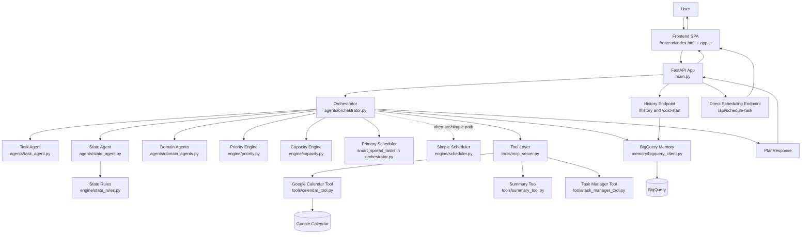

# Design Document

## Purpose

This document describes how the Productivity Agent codebase is structured today, how requests move through the system, and where the current implementation is intentionally lightweight or still evolving. It is meant to help an engineer understand the real design of the repository as implemented, not just the intended architecture.

## System Goal

The system converts natural-language planning input into a structured schedule that reflects:

- task urgency and difficulty
- user energy and stress signals
- recent workload history
- per-day effort limits
- follow-up edits to an existing plan

The user-facing experience is a chat-driven planner with an accompanying schedule view.

## High-Level Architecture

The current architecture has five logical layers:

1. Interface layer
2. Orchestration layer
3. Planning and state engine
4. Memory and tool integrations
5. Frontend presentation layer

## Architecture Diagram

### 1. Interface Layer

`main.py` exposes the HTTP surface:

- serves the static frontend
- exposes planning and modification routes
- provides history and cold-start endpoints
- includes a direct task-placement endpoint for unscheduled work

This layer is intentionally thin. Most logic is delegated to the orchestrator, except for the direct scheduling route and some request-model definitions.

### 2. Orchestration Layer

`agents/orchestrator.py` is the operational center of the application. It is responsible for:

- deciding whether the request is a fresh plan, a clarification case, a cold-start case, or a modification request
- coordinating task extraction
- merging new tasks with existing scheduled items and backlog memory
- applying domain-specific task augmentation
- invoking state inference and pruning rules
- scheduling tasks into day buckets
- generating a short natural-language response
- returning API-safe models to the frontend

In practice, this file currently owns a large portion of business logic, including plan modification and the primary scheduling path.

### 3. Planning And State Engine

The `engine/` package contains pure-ish business logic:

- `priority.py`: boosts near-deadline work and sorts tasks
- `capacity.py`: maps difficulty to effort points and computes daily ceilings
- `state_rules.py`: derives user state and prunes tasks when capacity should be reduced
- `scheduler.py`: a simple scheduler implementation

Important implementation detail:

The main orchestration flow does not currently use `engine/scheduler.py` as its primary scheduler. Instead, `agents/orchestrator.py` uses its own `smart_spread_tasks()` function, which supports progressive task spreading and preferred-day placement. This means the repository contains both a generic scheduler and a production scheduler path.

### 4. Memory And Tool Integrations

The system uses supporting modules for persistence and action hooks:

- `memory/bigquery_client.py`: reads and writes user history, backlog, and daily state data
- `tools/calendar_tool.py`: creates Google Calendar events
- `tools/summary_tool.py`: stores a daily summary via the BigQuery writer
- `tools/task_manager_tool.py`: mock task-management integration
- `tools/mcp_server.py`: simple tool registry wrapper

These integrations are partially wired. The API returns proposed actions, but tool execution is not yet fully orchestrated as part of the main request lifecycle.

### 5. Frontend Presentation Layer

The frontend is a static single-page app in `frontend/`:

- `index.html`: overall layout
- `app.js`: interaction logic, API calls, rendering, local storage
- `style.css`: presentation

The browser UI is stateful on the client side and keeps the active plan in memory and in `localStorage`.

## Request Lifecycle

### New Plan Flow

1. The client sends a `PlanRequest` to `POST /plan`.
2. `run_orchestrator()` extracts a task preview using `agents.task_agent.extract_tasks()`.
3. The orchestrator checks whether the user needs a cold-start flow based on missing history and lack of explicit state signals.
4. Existing plan state and unscheduled items are deserialized if the request is part of an ongoing conversation.
5. If the text looks like a modification request and a current plan exists, the modification branch runs instead of the new-plan branch.
6. For new planning, the system merges:
   - already scheduled tasks from the current client plan
   - backlog tasks from BigQuery
   - newly extracted tasks
7. Effective priorities are recalculated.
8. Domain agents can inject extra tasks based on travel or newborn-related context.
9. User state is inferred from text, explicit energy input, recent history, and workload.
10. Tasks are pruned according to state rules.
11. Remaining tasks are scheduled with `smart_spread_tasks()`.
12. A short conversational response is generated with Gemini.
13. The API returns a `PlanResponse`.

### Clarification Flow

If extracted tasks are missing required fields such as priority or difficulty:

- `task_agent` collects those tasks into a clarification set
- a short clarification message is generated
- the frontend renders interactive task cards so the user can fill in missing fields
- the completed card values are converted back into a compact task string and resubmitted to `/plan`

This split is important: the backend asks for clarification, but the UI is responsible for collecting the missing metadata in a structured way.

### Cold-Start Flow

Cold start is triggered when:

- there are fewer than 3 historical days for the user, and
- the user has not already provided enough state signal

The flow is:

1. `/plan` returns a clarification response with `clarification_question="cold_start"`.
2. The frontend marks itself as waiting for cold-start input.
3. The user replies with a free-form summary of recent workload or current energy.
4. `POST /cold-start/{user_id}` calls `parse_cold_start_response()`.
5. The inferred state and estimated capacity are backfilled into BigQuery for the previous few days.

### Modification Flow

If the user already has a plan and sends language such as "move", "reschedule", or "remove", the orchestrator:

1. serializes the current plan
2. asks Gemini to produce a JSON modification object
3. matches tasks by title hint
4. applies moves, reschedules, or removals
5. reruns domain-agent augmentation on the updated task set
6. optionally prepares proposed actions

The matching logic is heuristic. It relies on partial title matching and base task IDs for progressive subtasks.

## Task Model

The primary unit in the system is `models.schemas.Task`.

Key fields:

- `task_id`: stable identifier used in scheduling and modifications
- `title`: display and matching label
- `declared_priority`: user-stated priority
- `effective_priority`: priority after system upgrades
- `difficulty`: used to compute effort points
- `deadline`: optional ISO date string
- `effort_points`: derived effort value
- `scheduled_day`: integer day offset from today
- `unscheduled_reason`: explanation when not placed
- `domain_added`: indicates auto-generated tasks
- `work_style`: `single` or `progressive`
- `spread_days`: requested spread length for progressive work
- `session_number` and `total_sessions`: used when a progressive task is split

## Scheduling Design

### Effort Model

Difficulty is translated into effort points:

- `easy` -> `1`
- `medium` -> `2`
- `hard` -> `3`
- `tough` -> `4`

### Capacity Model

Daily ceiling is based on `UserState`:

- `normal`, `energetic`, `constrained` -> `12`
- `fatigued` -> `4`
- `overwhelmed` -> `0`

Negative feedback from memory can reduce the computed ceiling by 20%.

### Pruning Before Scheduling

The system reduces work before scheduling when the user is under strain:

- `overwhelmed`: keep only high-priority tasks
- `fatigued`: keep high-priority tasks and medium-priority tasks that have deadlines
- `constrained`: keep only tasks with deadlines

Pruned tasks are not deleted; they are returned as unscheduled with reason `pruned_by_state`.

### Progressive Task Handling

If a task is marked `work_style="progressive"` and includes `spread_days > 1`, the orchestrator:

- clones the task into multiple session tasks
- assigns session-specific IDs
- distributes estimated effort across sessions
- attempts to place sessions on preferred days before scanning the rest of the planning window

This capability exists only in the orchestrator’s scheduler path, not in `engine/scheduler.py`.

### Scheduling Horizon

The active scheduling horizon is 30 days, with a hard cap of 60 scheduled tasks in the orchestrator path.

## State Detection Design

State inference combines three signals:

### 1. Qualitative Signal

Derived from:

- explicit `state_inputs`
- text keywords such as "tired", "burnt out", "urgent", or "asap"

### 2. Quantitative Signal

Derived from recent BigQuery history such as daily capacity utilization.

### 3. Workload Signal

Derived from:

- total weighted workload
- count of high-priority tasks

If the current workload is too large, the system can classify the user as `overwhelmed` even without history.

## Persistence Design

BigQuery is used as lightweight memory rather than as a full operational database.

The memory table stores:

- `user_id`
- `date`
- `daily_capacity_utilized`
- `qualitative_state`
- `pending_backlog`
- `recovery_day_index`
- `daily_summary`
- `feedback`
- `created_at`

Primary read patterns:

- fetch recent history
- fetch latest record
- fetch and trim pending backlog
- count distinct historical days

Primary write patterns:

- store a single daily record
- backfill a few days during cold start

## Frontend Design

The frontend is intentionally simple and client-heavy:

- it stores current plan state in memory and browser storage
- it sends the full current plan back to the backend on each follow-up request
- it renders scheduled days, unscheduled tasks, and proposed actions
- it supports direct backlog placement through `/api/schedule-task`

This keeps the backend stateless for interactive planning, at the cost of placing more responsibility on the client to preserve conversation state.

## API Contracts

### `PlanRequest`

Fields:

- `user_id: str`
- `input_text: str`
- `state_inputs: Optional[StateInputs]`
- `confirm_actions: bool`
- `current_plan: Optional[List[Any]]`
- `current_unscheduled: Optional[List[Any]]`
- `current_summary: Optional[str]`

### `PlanResponse`

Fields:

- `user_id`
- `response_text`
- `detected_state`
- `plan`
- `unscheduled_tasks`
- `adjustments_applied`
- `actions_proposed`
- `needs_clarification`
- `clarification_question`
- `daily_summary`

## Non-Goals In The Current Version

The repository does not yet provide:

- robust authentication or user-session security
- transactional persistence of every generated plan
- deterministic tool execution on confirm
- conflict-aware calendar time slot allocation
- strong test coverage
- fully normalized storage for tasks and plans

## Design Strengths

- Clear end-to-end demo value with relatively little code
- Good separation between schema, engine, memory, and UI concerns
- Graceful extraction fallback when model calls fail
- Useful progressive-task concept for realistic planning
- State-aware pruning keeps plans more humane under overload

## Design Risks And Technical Debt

- Business logic is concentrated in `agents/orchestrator.py`, which makes it harder to test and evolve.
- There are two scheduling implementations, which can drift.
- `main.py` contains duplicated model and route definitions for direct scheduling.
- Tool integrations are represented in responses but not fully executed in the main request path.
- Client-side plan state is the source of truth during interaction, which can lead to divergence if multiple clients are used.
- Some hard-coded strings and encoding artifacts reduce polish and maintainability.

## Recommended Next Refactors

1. Move all scheduling logic into a single engine module and keep the orchestrator thin.
2. Extract modification parsing and application into a dedicated service module with tests.
3. Remove duplicate endpoint definitions in `main.py`.
4. Add plan persistence after successful scheduling.
5. Wire `/confirm` to actual tool execution through `tools.mcp_server`.
6. Add integration tests for clarification, cold-start, and modification flows.

## Deployment Notes

- The app can run locally with `python main.py` or under Uvicorn.
- The provided `Dockerfile` uses `python:3.12-slim`.
- Frontend assets are served directly by FastAPI.
- Gemini, BigQuery, and Calendar integrations all rely on environment configuration being present at runtime.
